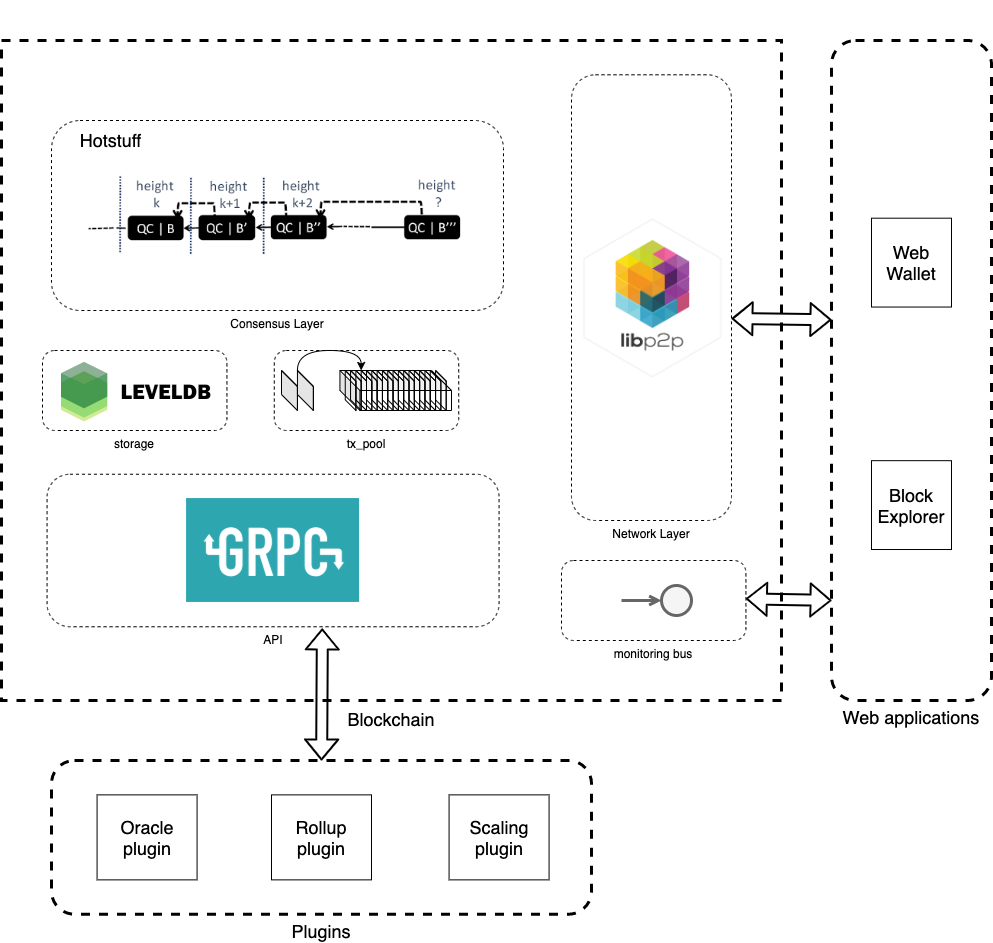

Gagarin.network consists or four major layers:
- [Network layer](networking.md). Libp2p is a modular system of protocols, specifications and libraries that enable the development of peer-to-peer network applications. 
- [Consensus protocol](consensus.md). HotStuff is a leader-based Byzantine fault-tolerant replication protocol for the partially synchronous model.
- [Blockchain](blockchain.md) with [state](state.md), [crypto schemes](encryption.md) and [transactions](transactions.md) create the token and asset layer of the system.
- [API](api.md) and [Integration Buss](buss.md). Api is an gRpc integration protocol used for custom application development. Buss provides WebSocket integration interface to create rich UIs. 

Gagarin.network provides 2 web applications:
- [Web wallet](utils.md) consists of js and golang libraries used to send transactions
- [Block explorer](monitoring.md) is a React single page applications, which provides monitoring functionality

Gagarin.network has several system [plugins](plugins.md)
- [Oracle plugin](oracles.md) is used to provide external facts import to the blockchain
- [Rollup plugin](rollups.md) is used to integrate Gagarin.network with other blockchains
- [GateWay plugin](gateway.md) is used to scale ERC-20 tokens and enhance it with additional functions

