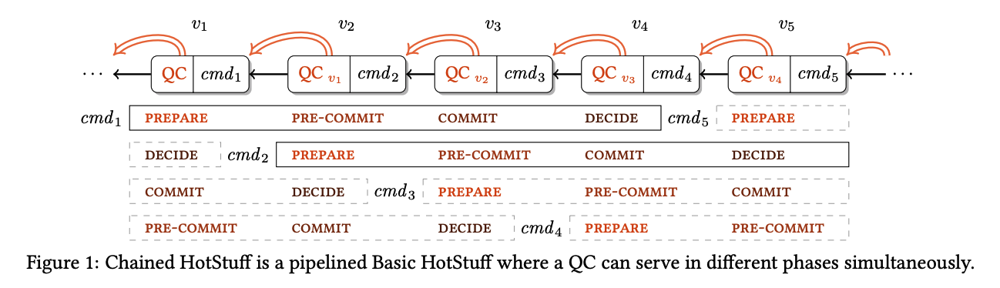
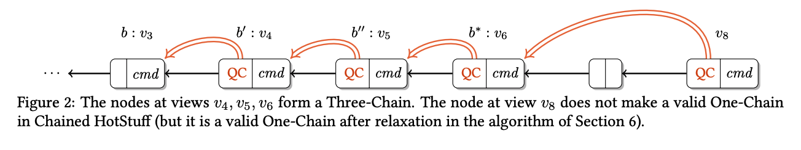

HotStuff is a leader-based Byzantine fault-tolerant replication protocol for the partially synchronous
model.

We are sincerely grateful to scienties and researchers Maofan Yin, Dahlia Malkhi, Michael K.Reiter, Guy Golan Gueta and Ittai Abraham who designed [HotStuff protocol](https://arxiv.org/pdf/1803.05069.pdf). Without their achievements our project would not be possible. We implemented Hotstuff very close to the original protocol therefore discription below refers to its designers.

## Basic Hotstuff
HotStuff solves the State Machine Replication (SMR) problem. At the core of SMR is a protocol for deciding on a
growing log of blocks requests by clients. A group of state-machine replicas apply blocks in sequence order
consistently. A client sends a block proposal request to all replicas, and waits for responses from (f + 1) of them. 

The Basic HotStuff solution is presented in Algorithm 2. The protocol works in a succession of views numbered
with monotonically increasing view numbers. Each viewNumber has a unique dedicated leader known to all. Each
replica stores a tree of pending transactions as its local tx_pool. Each tree node contains a block, metadata associated with the protocol, and a parent link. The branch led by a given node is
the path from the node all the way to the tree root by visiting parent links. During the protocol, a monotonically
growing branch becomes committed. To become committed, the leader of a particular view proposing the branch
must collect votes from a quorum of (n − f) replicas in three phases, prepare, pre-commit, and commit.

A key ingredient in the protocol is a collection of (n − f) votes over a leader proposal, referred to as a quorum
certificate (or “QC” in short). The QC is associated with a particular block and a view number. The BLS signature aggrigation 
employs a threshold signature scheme to generate a representation of (n−f) signed votes as a single authenticator.
Below we give an operational description of the protocol logic by phases.

## Phases
### Prepare phase 
The protocol for a new leader starts by collecting new-view messages from (n − f) replicas.
The new-view message is sent by a replica as it transitions into viewNumber (including the first view) and carries
the highest prepareQC that the replica received (or genesis if none), as described below.

The leader processes these messages in order to select a branch that has the highest preceding view in which
a prepareQC was formed. The leader selects the prepareQC with the highest view, denoted highQC, among the
new-view messages. Because highQC is the highest among (n − f) replicas, no higher view could have reached a
commit decision. The branch led by highQC.block is therefore safe. 

The leader uses the createLeaf method to extend the tail of highQC.block with a new proposal. The method creates a new leaf block as a child and embeds a digest of the parent in the child block. The leader then sends the new
block in a prepare message to all other replicas. The proposal carries highQC for safety justification.

Upon receiving the prepare message for the current view from the leader, replica r uses the safeNode predicate
to determine whether to accept it. If it is accepted, the replica sends a prepare vote with a partial signature (produced
by bls signature aggregation) for the proposal to the leader.

### SafeNode predicate
The safeNode predicate is a core ingredient of the protocol. It examines a proposal message
m carrying a QC justification m.justify, and determines whether m.block is safe to accept. The safety rule to accept
a proposal is the branch of m.block extends from the currently locked block lockedQC.block. On the other hand, the
liveness rule is the replica will accept m if m.justify has a higher view than the current lockedQC. The predicate is
true as long as either one of two rules holds.

### Pre-commit phase 
When the leader receives (n − f) prepare votes for the current proposal curProposal, it
combines them into a prepareQC. The leader broadcasts prepareQC in pre-commit messages. A replica responds
to the leader with pre-commit vote having a signed digest of the proposal.

### Commit phase 
The commit phase is similar to pre-commit phase. When the leader receives (n−f) pre-commit
votes, it combines them into a precommitQC and broadcasts it in commit messages; replicas respond to it with a
commit vote. Importantly, a replica becomes locked on the precommitQC at this point by setting its lockedQC
to precommitQC. This is crucial to guard the safety of the proposal in case it becomes a
consensus decision.

### Decide phase 
When the leader receives (n − f) commit votes, it combines them into a commitQC . Once
the leader has assembled a commitQC, it sends it in a decide message to all other replicas. Upon receiving a
decide message, a replica considers the proposal embodied in the commitQC a committed decision, and executes
the commands in the committed branch. The replica increments viewNumber and starts the next view.

### NextView interrupt 
In all phases, a replica waits for a message at view viewNumber for a timeout period,
determined by an auxiliary nextView(viewNumber ) utility. If nextView(viewNumber ) interrupts waiting, the
replica also increments viewNumber and starts the next view.

## Chained Hotstuff
It takes three phases for a Basic HotStuff leader to commit a proposal. These phases are not doing “useful” work
except collecting votes from replicas, and they are all very similar. In Chained HotStuff, we improve the Basic
HotStuff protocol utility while at the same time considerably simplifying it. The idea is to change the view in every
prepare phase, so each proposal has its own view. This reduces the number of message types and allows for pipelining
of decisions. A similar approach for message type reduction was suggested in Casper.



More speciffically, in Chained HotStuff the votes over a prepare phase are collected in a view by the leader into a
genericQC. Then the genericQC is relayed to the leader of the next view, essentially delegating responsibility for
the next phase, which would have been pre-commit, to the next leader. However, the next leader does not actually
carry a pre-commit phase, but instead initiates a new prepare phase and adds its own proposal. This prepare
phase for view v + 1 simultaneously serves as the pre-commit phase for view v. The prepare phase for view v + 2
simultaneously serves as the pre-commit phase for view v + 1 and as the commit phase for view v. This is possible
because all the phases have identical structure.

The pipeline of Basic HotStuff protocol phases embedded in a chain of Chained HotStuff proposals is depicted in
Figure 1. Views v1, v2, v3 of Chained HotStuff serve as the prepare, pre-commit, and commit Basic HotStuff phases
for block1 proposed in v1. This block becomes committed by the end of v4. Views v2, v3, v4 serve as the three
Basic HotStuff phases for cmd2 proposed in v2, and it becomes committed by the end of v5. Additional proposals
generated in these phases continue the pipeline similarly, and are denoted by dashed boxes. In Figure 1, a single
arrow denotes the b.parent field for a block b, and a double arrow denotes b.justify.block.

Hence, there are only two types of messages in Chained HotStuff, a new-view message and generic-phase
generic message. The generic QC functions in all logically pipelined phases. We next explain the mechanisms
in the pipeline to take care of locking and committing, which occur only in the commit and decide phases of Basic
HotStuff.

### Empty blocks 
The genericQC used by a leader in some view viewNumber may not directly reference the proposal of the preceding view (viewNumber −1). The reason is that the leader of a preceding view fails to obtain a QC, either because there are conflicting proposals, or due to a benign crash. To simplify the tree structure, createLeaf
extends genericQC.block with empty blocks up to the height (the number of parent links on a block’s branch) of the
proposing view, so view-numbers are equated with block heights. As a result, the QC embedded in a block b may not
refer to its parent, i.e., b.justify.block may not equal b.parent (the last block in chained.png).

### One-Chain, Two-Chain, and Three-Chain 


When a block b∗ carries a QC that refers to a direct parent, i.e., b∗.justify.block = b∗.parent, we say that it forms a One-Chain. Denote by b" = b∗.justify.block. Block b∗ forms a Two-Chain, if in addition to forming a One-Chain, b".justify.block = b".parent. It forms a Three-Chain, if b" forms a Two-Chain.

Looking at chain b = b'.justify.block, b' = b".justify.block, b" = b∗.justify.node, ancestry gaps might occur at any one of the nodes. These situations are similar to a leader of Basic HotStuff failing to complete any one of three phases, and getting interrupted to the next view by nextView. 

If b∗ forms a One-Chain, the prepare phase of b" has succeeded. Hence, when a replica votes for b∗, it should remember genericQC ← b∗.justify. We remark that it is safe to update genericQC even when a One-Chain is not direct, so long as it is higher than the current genericQC. 

If b∗ forms a Two-Chain, then the pre-commit phase of b' has succeeded. The replica should therefore update lockedQC ← b".justify. Again, we remark that the lock can be updated even when a Two-Chain is not direct—safety will not break—and indeed, this is given in the implementation code in Section 6. 

Finally, if b∗ forms a Three-Chain, the commit phase of b has succeeded, and b becomes a committed decision.


## Pacer
Pacer is a mechanism that guarantees progress after GST.
At first, pacer makes progress happen every view change, bringing all correct replicas, and a chosen leader, into a common height for a
sufficiently long period. For this purpose ∆ max time is spent at every height waiting for appropriate action to be made. 
After progress has been made or ∆ time is out, the network changes view and chooses next proposer (leader). We use round-robin for proposer to switch. All correct replicas store a predefined committee list and rotate to the next one when the leader is demoted. For advanced setups it is possible to use VDF (Verifiable Delay Functions) or every other decentralized source of randomness to switch proposers in stochastic way.
This mechanism helps replicas to recover after large network crashes and decide which epoch they were working on last time progress has been achieved.

At first glance it looks easy to synchronize nodes and keep them at common pace when strong majority (2f + 1) of nodes share the same round, but unfortunately it doesn't. 

Optimistic responsiveness makes this job pretty well, since there is no need to synchronize nodes excessively and they progress with every new proposal. Synchronization become important when optimistic responsiveness breaks and progress is not achieved by it own. 
 
When network do not achieve progress and all nodes stuck at different rounds the real problems begin. How can network solve it?
1. To have some static timetable to stick to
2. To have dynamic timetable to stick to
3. To have advanced synchronization technique

### Static timetable
 This approach is the most obvious although the slowest one. We can create static timetable the same as synchronous networks have and if node does not receive proposal it starts to wait till appropriate slot and then increases its rounds due to timetable. Although this approach guarantees eventual synchronization it can eliminate all benefits of optimistic responsiveness.

### Dynamic timetable 
This approach is more advanced and is suggested in several papers. Main idea behind it is to allow node decide every synchronization interval length by itself, since nodes were synchronized once it makes sense. 

Assume our network is not synchronized and we have k nodes groups each timed out at separate round and assume that progress is achieved instantly for ease. Assume every group spends ti time on each view waiting for synchronization. Assume we have two groups stuck on a-th and b-th views and a < b for clarity. Than for group stuck on a-th view to reach b-th group we need their time frames to overlap on common view: | Sum(tj) - Sum(ti)| < tk | j=a..k i=b..k, for every two group sums of all time frames spent must be less than last time frame where they meet. 
  
In common, time to wait ti can be generated by exponential function ti = a + b^i, i should be started at last synchronized round of each group, but in practice to agree on such round is not an easy task at all. 
At first network can choose mechanism to detect such a round explicitly, which is not a good idea in the present of f adversarials. Second, network can make checkpoints every k rounds and start counting gaps from first round after checkpoint. It is exactly the mechanics we implemented preveously. This approach is similar to one introduced in first version and deleted in next versions of Hotstuff paper. The idea is pretty simple and consists in having synchronization sessions every committee full rotation (``len(committee)`` rounds).

Synchronization is achieved through epoch starting mechanism. Epoch is a consecutive committee.size of views. Starting at first view and every committee.size view the network starts an epoch via message exchange between replicas sending current known epoch number and HQC. 
The main point is to receive (n - f) messages about the current epoch number and enter first view on current epoch to start making progress if optimistic responsiveness is achieved or waiting ∆ seconds. It gives protocol a timeline which is revisited every epoch.

This mechanics is pretty robust and even help synchronize after GST, but has a huge drawback. Let's consider further attack

#### Split attack
In presents of dynamic adversarial they can split network to f groups each in it's own separate round. To achieve this kind of split let k...k+f leaders be adversarials in order and let k=0 for ease. Every new adversarial leader isolates the leader of f + 1 round and propose to the rest of network. 
Adversarials take part in voting and votes for each proposal as if they were honest ones. On round k+f there will be f+1 nodes each on k..k+f round and big group with f honest and f faulty nodes. Big group can't achieve progress now since no consortium can be achieved and f honest nodes times out.  
That's it, new consortium will be achieved in O(e^f) time, and only after that optimistic responsiveness can be achieved again.

### Synchronization technique
We make several adjustments to Hotstuff protocol. 
1. Progress is made due to QC update ``QC_received.block.height > HQC``, new round r = QC.block.height + 1. Every honest leader must send generated QC in every proposal it sends and if such QC can't be generated honest leader must time out.
2. When new QC is not received during 2*∆ interval, node enters synchronization phase and broadcasts Sync message to all nodes.
3. When node receives 2*f+1 Sync messages it forms Synchronize Certificate (SC)
4. When node receives SC it acts similar to receiving QC and forces round to SC.height+1 
5. When node do not vote on current round it sends Voting Sync message with appropriate flag, Voting SC (VSC) formed by such Syncs can act as anchor QC for empty block.

VSC has no Qref block in it, but it can be used in Hotstuff rules as QC that points to any empty block on given height. It helps much in commit rule to achieve commits faster.

## Messages
### Sync
```proto
message SynchronizePayload {
    oneof cert {
        QuorumCertificate qc = 1;
        SynchronizeCertificate sc = 2;
    }
    Signature signature = 3;
    Signature votingSignature = 4;
    int32 height = 5;
}
```
Message used to agree on epoch number

### Proposal
```proto
message ProposalPayload {
    oneof cert {
        QuorumCertificate qc = 1;
        SynchronizeCertificate sc = 2;
    }
    Signature signature = 3;
    Block block = 4;
}

```
Message used to propose block

### Vote

```proto
message VotePayload {
    oneof cert {
        QuorumCertificate qc = 1;
        SynchronizeCertificate sc = 2;
    }
    Signature signature = 3;
    BlockHeader header = 4;
}
```
Message used to vote on proposal

### Quorum Certificate

```proto
message QuorumCertificate {
    CertType    type = 1;
    BlockHeader header = 2;
    SignatureAggregate signatureAggregate = 3;

    enum CertType {
        QREF   = 0;
        EMPTY    = 1;
    }
}
```

### Synchronize Certificate

```proto
message SynchronizeCertificate {
    int32 height = 1;
    SignatureAggregate signatureAggregate = 3;
}
```