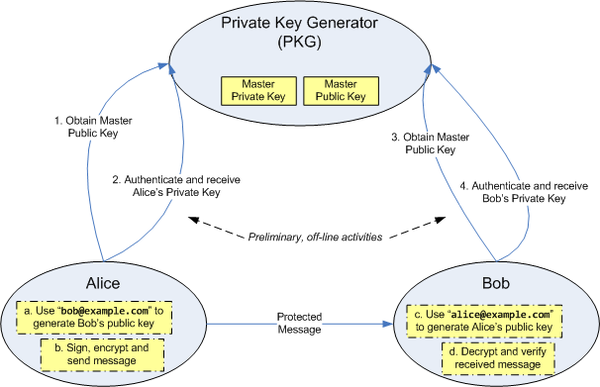

A BLS digital signature— also known as Boneh–Lynn–Shacham[not verified in body] (BLS)—is cryptographic signature scheme which allows a user to verify that a signer is authentic.
The scheme uses a bilinear pairing for verification, and signatures are elements of an elliptic curve group. We use BLS12-381 curve, it is exactly the same curve Ethereum 2.0 uses.
With BLS signatures we get
1. Signature aggregation mechanics, unlike Schnorr signatures it does not rely on random number generator, moreover we do not need any communication and starting setup
2. Make m-of-n multisig scheme, unlike Schnorr we do not need any workarounds such as merkle tree of public key and so on
3. Signature is short
4. Paring friendly curve allows us using fancy cryptography like zero knowledge primitives and identity based encryption.

## Identity based encryption 
BLS12-381 curve allows us to create a lot of fancy things, such as identity-based encryption (IBE), attribute-based encryption (ABE), authenticated key exchange (AKE), short signatures and so on. 
The most interesting for us is identity-based encryption (IBE), with IBE we can achieve two goals
1. User can use email address or whatever identity network wants as public key
2. Network can revoke and reissue private keys using centralized key authority center

[Boneh and Franklin’s](https://crypto.stanford.edu/~dabo/papers/bfibe.pdf) identity-based encryption scheme is perhaps the most famous
early example of what could be achieved using bilinear maps, but researchers were unable
to build a practical scheme by conventional means for approximately twenty years. Boneh
and Franklin found an elegant solution using bilinear maps. Extending the basic idea
leads to identity-based schemes with additional useful properties such as authenticated
or hierarchical identity-based encryption. 

## Schnorr on Edwards curve (EdDCA)
BLS signature verification is order of magnitude harder than EdDSA. Signature aggregation for the whole block with 1000 transactions still requires to compute 1000 pairing, so verifying one tiny signature in a block may take longer than verifying 1000 separate EdDSA signatures. 
The only benefit we achieve here is that we can fit more transactions in the block as aggregated signature takes only ~32 bytes.

Unlike BLS, Schnorr signatures are very efficient — they can be validated all together and this process is factor of 3 more efficient than EdDSA. 

For systems with huge transaction load we use [Ed25519](https://ed25519.cr.yp.to/) which is the EdDSA signature scheme using SHA-512 (SHA-2) and Curve25519
                                              