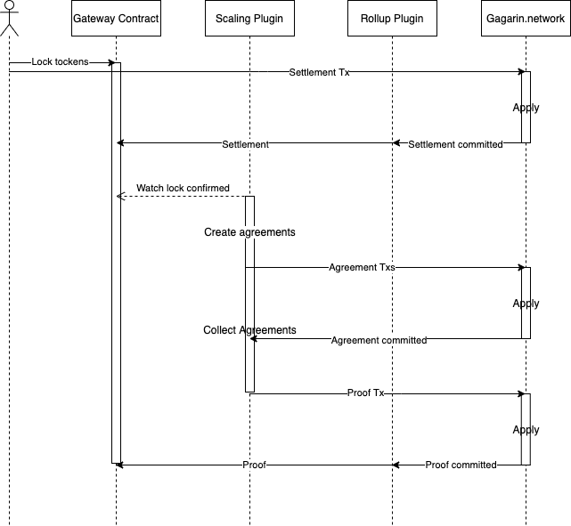

Gagarin.network can be used as Ethereum side-chain. G.N provides gateway mechanics which are a powerful tool for scaling existing ERC-20 tokens.

At first the client should be a member of Gagarin.network and own G.N credentials. Gateway contract keeps mapping between Ethereum addresses and G.N addresses. By default there are several government accounts set in contract, these accounts can register users via register method.

1. At first the user should grant allowance to Gateway contract for needed amount of tokens to transfer. 
2. To initiate token transfer the user calls `lockTokens(uint _amount)` on Gateway contract and initiates settlement transaction in Gagarin.network.
3. After block with settlement transaction is committed, scaling plugin starts to wait for gateway tokens locking to be committed in PoW way (10 blocks deep). 
4. Every Gagarin node, which sees lock commitment, compares Ethereum lock with settlement and if they are equal, it sends agreement transaction to the network.
5. When 2f + 1 of settlements are committed in Gagarin.Network current proposer uses scaling plugin and sends proof transaction to G.N
6. When proof transaction is committed, deposit is confirmed and token lock is successful.

User can occasionally skip one of the steps of the algorithm, if it happens he can unlock tokens calling `cancelDeposit()` function after ``pendingTTL`` blocks.

Adversarial user can try to cancel deposit in Ethereum network and execute proof transaction in Gagarin.network. To prevent this type of attacks scaling plugin checks how many blocks have been mined since locking transaction and accepts ``pendingWaitBlocks`` from head (``pendingWaitBlocks`` >> ``pendingTTL``).

## Gateway contract
Gateway is Ethereum contract which provides two main functions:
- locking and unlocking of ERC-20 tokens 
- registering and unregistering Ethereum addresses and binding them to Gagarin addresses

## Scaling plugin
Oracle plugin in Gagarin.network. 
- fetches events from Gateway contract in Ethereum
- sends agreement txs to G.N when needed conditions are met

## Rollup plugin
Rollup plugin processes receipts every block commit and sends rolled-up transactions to rollup contract in Ethereum network.
