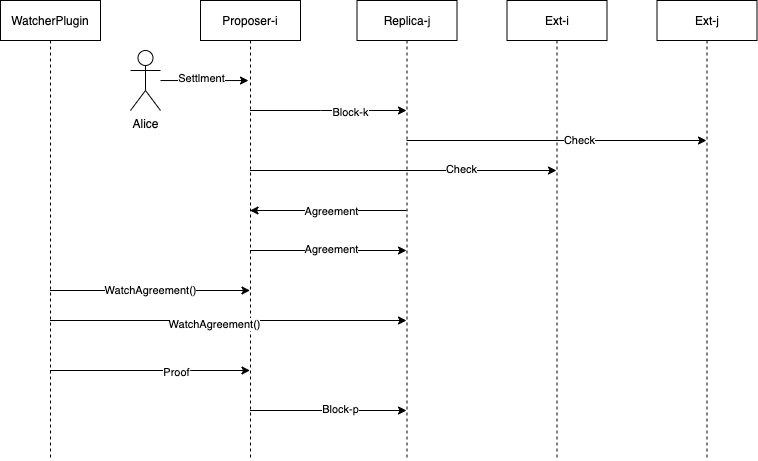

Blockchains can't query data from external world and by design are closed systems. In order to allow blockchains tocommunicate with others oracles are introduced.
In Gagarin.network oracles are the built-in mechanism used to provide external facts into blockchain. Since we build Gagarin.Network around stablecoin idea we use oracles to confirm money transfer or locks from external financial systems and blockchains to our network. Let's look closer how they work



Alice want to increase her deposit and transfer her assets from her bank account (probably lock them) to gagarin's account. 
1. She sends ```Settlement``` transaction to arbitrary node, for simplicity this node will always be proposer. ```Settlement``` transaction's fee should be bigger than DefaultSettlementReward.
2. Proposer proposes block with this transaction to other replicas. 
3. Replicas query their trusted service of truth (through oracle plugin) to validate that Alice had interacted with the bank and locked her funds. 
4. If ```Settlement``` is valid and Alice indeed locked her funds each replica send ```Agreement``` transaction to the network. ```Agreement ``` is the special transaction that contains signed ```Settlement``` hash as cryptographic proof of settlement validity. ```Agreement``` transaction always sent to ```Settlement``` address.
5. When the transactions are committed WatcherPlugin collects proofs, and when he gets n - f proofs, he sends ```Proof``` transaction with aggregated signature of ```Settlement``` hash. This transaction contains cryptographic proof that n-f replicas confirmed ```Settlement``` validity. ```Proof``` transaction always sent to ```Settlement``` address. *We must admit, that Plugins are run on each replica and are not separate network entities, they are drawn this way for clarity*
6. When ```Proof``` transaction is included in block and committed, Alice's balance increases.

The address of ```Settlement``` is calculated in the following way ```common.BytesToAddress(settlement.Hash().Bytes()[12:]).Bytes())```
