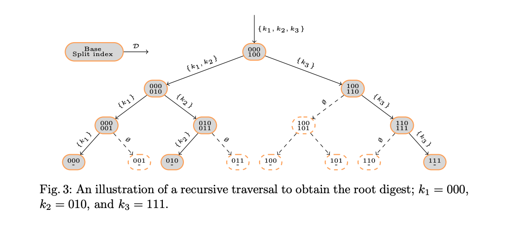

## State model
Gagarin.network uses an account-based data model to encode the ledger state. The state is structured as a key-value store, which maps account address keys to account values. 
An account value in the ledger state is wallet balance and possibly amount of assets kept. The initial set of accounts and their state are specified in the
genesis ledger state.

## Account addresses 
An account address is a 160-bit value exactly the same as Ethereum addresses are. To create a new account, a user
first generates (more details in key section) a fresh verification/signature key-pair (pk, sk) for chosen signature scheme and uses last 20 bytes of the
cryptographic hash keccak256 of the public key as an account address. The new
account is created in the ledger typically when a transaction attempts to send funds to an account at address that has not yet been created.

## Storage
We use levelDB to persist state, blockchain and network specific data.
LevelDB is a fast key-value storage library written by google fellows Sanjay Ghemawat and Jeff Dean that provides an ordered mapping from string keys to string values.
Despite of levelDB's it is pretty good for local data persistent, main limitations are as follow:
- This is not a SQL database. It does not have a relational data model, it does not support SQL queries, and it has no support for indexes.
- Only a single process (possibly multi-threaded) can access a particular database at a time.
- There is no client-server support builtin to the library. An application that needs such support will have to wrap their own server around the library.

Data stored in storage is not usable for BI and heavy data analytics, you should use monitoring buss for data streaming instead or load levelDB files manually offline. 

LevelDB do not support RDBMS-like table objects, instead we divide data by key prefixes, here the list
```golang
type ResourceType byte

const Block = ResourceType(0x0)
const HeightIndex = ResourceType(0x1)
const CurrentEpoch = ResourceType(0x2)
const CurrentView = ResourceType(0x3)
const TopCommittedHeight = ResourceType(0x4)
const CurrentTopHeight = ResourceType(0x5)
const Snapshot = ResourceType(0x6)
const Record = ResourceType(0x7)
const VHeight = ResourceType(0x8)
const LastExecutedBlock = ResourceType(0x9)
const HQC = ResourceType(0xa)
```

## Merkle tree
A Sparse Merkle tree is a binary tree that incorporates the use of cryptographic hash
functions. One or many attributes are inserted into the leaves, and every node
derives a digest which is recursively dependent on all attributes in its subtree.
That is, leaves compute the hash of their own attributes, and parents derive the
hash of their children’s digests concatenated left-to-right. 
SMT contains a distinct leaf for every possible output from a cryptographic hash function, and can
be simulated efficiently because the tree is sparse (i.e., most leaves are
empty).




We use SMT for state representation of blockchain. We use address of account as tree key to calculate leaf to store address value hash in. As account address is 20 byte length, SMT is 21 level high with 2^20 leafs possible in theory. With SMT it is possible to get cryptographic proof of fact that current account has given value, or do not have any value at all. Proof is 20 hashes, starting from hashed value and consequence union of hashes of parent nodes in the tree. Hash of tree node is a hash of concatenation of values of its left and right children.

### Proof use in light clients
Proofs are the key elements for light clients. The idea behind proof use is that light client can simply load BlockHeaders without block bodies and build light blockchain representations. Let Alice want to prove that she has sufficient funds or assets on her account and let Bob try to verify it running the light client. To prove that Alice can provide proof calculated for her account in this block. Bob can compare the head of the proof with ```statehash``` field from block header and if they are equal he can be confident that Alice tells the truth. 

## Snapshot
Since every new block can initiate blockchain forking, state should be forked too. The naive way of forking state is copying it every time new block arrives and apply transactions to this state copy. 
It can possibly work for systems with small amount of accounts, but in more complex and heavy loaded systems these copies will waste a lot of resources.

More advanced technique is to store only fragments of Merkle tree that was updated during block executing.
For that purpose we use special structure called Snapshot. 

1. For every new block an empty snapshot linked to parent's snapshot is created. 
2. When account's (which is actually a leave of SMT) balance is updated, every parent tree node hash must be updated in case.
3. When block is committed all snapshots are merged on the path through last committed block sequentially. 
In 3 we use nice Hotstuff ability to guarantee fast commit every epoch. In absence of forking committed block will always has actual state tree and if we do not need state change history we simply merge all previous snapshots preemptively .  

To get actual SMT proof for account in current block, we have to lookup all nodes from leaf to head in current snapshot, if not found lookup its parent's snapshot and so on upto committed snapshot.

>we will draw diagram soon    